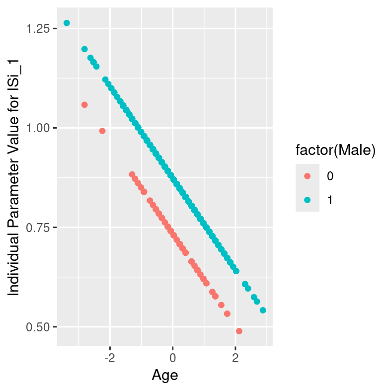

Moderated nonlinear factor analysis (MNLFA) has been proposed by @bauerMoreGeneralModel2017
to assess measurement invariance. The general idea is that parameters within
the model (that is, loadings, regressions, intercepts, and (co-)variances) may
differ across individuals. These differences are predicted using covariates such
as age and gender. For instance, @kolbeAssessingMeasurementInvariance2022 demonstrate
MNLFA using the following model:


The loading `lSi_1` may differ linearly by age and gender [@kolbeAssessingMeasurementInvariance2022].
That is `lSi_1 = lSi0_1 + lSi1_1*Age  + lSi2_1*Male`.
If `lSi1_1` or `lSi2_1` are non-zero, this suggests measurement non-invariance.

MNLFA is a powerful procedure, but specifying the models can be tedious.
@kolbeAssessingMeasurementInvariance2022 provide an in-depth introduction using
**OpenMx** using the DS14 data set by @denolletPredictiveValueSocial2013
included in the **mokken** [@MokkenScaleAnalysis2007] package.

The script for the tutorial by @kolbeAssessingMeasurementInvariance2022 can
be found on osf at https://osf.io/527zr. The following pre-processing steps
are taken directly from that script:


```r
# code copied from Laura Kolbe, Terrence D. Jorgensen, Suzanne Jak, and Dylan Molenaar
# at https://osf.io/527zr

library(mokken)
#> Loading required package: poLCA
#> Loading required package: scatterplot3d
#> Loading required package: MASS

## Load data
data("DS14", package="mokken")

## Save as data frame
DS14 <- data.frame(DS14)

## Recode negatively worded items
DS14$Si1 <- 4 - DS14$Si1.
DS14$Si3 <- 4 - DS14$Si3.

## Standardize age
DS14$Age <- (DS14$Age - mean(DS14$Age))/sd(DS14$Age)
# mean-centering age is another option, but caused convergence difficulties with
# this dataset

## Change order of variables
DS14 <- DS14[,c("Male","Age","Si1","Si3","Si6","Si8","Si10","Si11","Si14",
                "Na2","Na4","Na5","Na7","Na9","Na12", "Na13")]

## Check data
head(DS14)
#>   Male         Age Si1 Si3 Si6 Si8 Si10 Si11 Si14 Na2 Na4 Na5 Na7 Na9 Na12 Na13
#> 1    1  0.03136864   2   2   2   3    2    2    4   3   2   2   3   2    4    2
#> 2    1 -0.44266587   2   1   2   2    2    4    2   0   0   0   0   0    3    0
#> 3    1 -0.82189349   3   3   2   2    2    2    1   3   1   1   2   2    1    1
#> 4    1 -0.63227968   2   2   1   2    3    1    1   3   0   0   0   1    1    0
#> 5    1  0.03136864   2   3   2   3    3    2    3   2   2   2   3   2    3    1
#> 6    0 -0.06343826   0   0   0   0    0    0    0   3   1   2   1   2    4    2
```

## Model specification

We want to specify the configural model outlined in @kolbeAssessingMeasurementInvariance2022.
In this model, all loadings, intercepts, variances and co-variances are predicted
with the covariates `Age` and `Male`. The only parameter that is constant across
all subjects are the latent variances of `Si` and `Na`, which are fixed to 1 for
scaling.

For demonstrative purposes, we will first set up a confirmatory factor analysis
without the `Age` and `Male` covariates. Using **mxsem**, the syntax could look
as follows:


```r
cfa_syntax <- "

# loadings
Si =~ lSi_1*Si1  +
      lSi_3*Si3  +
      lSi_6*Si6  +
      lSi_8*Si8  +
      lSi_10*Si10 +
      lSi_11*Si11 +
      lSi_14*Si14

Na =~ lNa_2*Na2  +
      lNa_4*Na4  +
      lNa_5*Na5  +
      lNa_7*Na7  +
      lNa_9*Na9 +
      lNa_12*Na12 +
      lNa_13*Na13

# latent variances and covariances
Si ~~ 1*Si
Na ~~ 1*Na + cov*Si

# manifest variances
Si1  ~~ vSi_1*Si1
Si3  ~~ vSi_3*Si3
Si6  ~~ vSi_6*Si6
Si8  ~~ vSi_8*Si8
Si10 ~~ vSi_10*Si10
Si11 ~~ vSi_11*Si11
Si14 ~~ vSi_14*Si14

Na2  ~~ vNa_2*Na2
Na4  ~~ vNa_4*Na4
Na5  ~~ vNa_5*Na5
Na7  ~~ vNa_7*Na7
Na9  ~~ vNa_9*Na9
Na12 ~~ vNa_12*Na12
Na13 ~~ vNa_13*Na13

# intercepts
Si1  ~ iSi_1*1
Si3  ~ iSi_3*1
Si6  ~ iSi_6*1
Si8  ~ iSi_8*1
Si10 ~ iSi_10*1
Si11 ~ iSi_11*1
Si14 ~ iSi_14*1

Na2  ~ iNa_2*1
Na4  ~ iNa_4*1
Na5  ~ iNa_5*1
Na7  ~ iNa_7*1
Na9  ~ iNa_9*1
Na12 ~ iNa_12*1
Na13 ~ iNa_13*1
"
```

We want to predict each and every parameter in this model using `Age` and `Male`.

* `lSi_1 = lSi0_1 + lSi1_1*Age  + lSi2_1*Male`
* `lSi_3 = lSi0_3 + lSi1_3*Age  + lSi2_3*Male`
* ...
* `iNa_4 = iNa0_4 + iNa1_4*Age  + iNa2_4*Male`
* ...

With **mxsem**, this can be implemented as follows:


```r
mnlfa_syntax <- "
==== MNLFA ====

SI =~ {lSi_1  := lSi0_1  + lSi1_1*data.Age  + lSi2_1*data.Male }*Si1  +
      {lSi_3  := lSi0_3  + lSi1_3*data.Age  + lSi2_3*data.Male }*Si3  +
      {lSi_6  := lSi0_6  + lSi1_6*data.Age  + lSi2_6*data.Male }*Si6  +
      {lSi_8  := lSi0_8  + lSi1_8*data.Age  + lSi2_8*data.Male }*Si8  +
      {lSi_10 := lSi0_10 + lSi1_10*data.Age + lSi2_10*data.Male}*Si10 +
      {lSi_11 := lSi0_11 + lSi1_11*data.Age + lSi2_11*data.Male}*Si11 +
      {lSi_14 := lSi0_14 + lSi1_14*data.Age + lSi2_14*data.Male}*Si14

NA =~ {lNa_2  := lNa0_2  + lNa1_2*data.Age  + lNa2_2*data.Male }*Na2  +
      {lNa_4  := lNa0_4  + lNa1_4*data.Age  + lNa2_4*data.Male }*Na4  +
      {lNa_5  := lNa0_5  + lNa1_5*data.Age  + lNa2_5*data.Male }*Na5  +
      {lNa_7  := lNa0_7  + lNa1_7*data.Age  + lNa2_7*data.Male }*Na7  +
      {lNa_9  := lNa0_9  + lNa1_9*data.Age  + lNa2_9*data.Male }*Na9  +
      {lNa_12 := lNa0_12 + lNa1_12*data.Age + lNa2_12*data.Male}*Na12 +
      {lNa_13 := lNa0_13 + lNa1_13*data.Age + lNa2_13*data.Male}*Na13

SI ~~ 1*SI
NA ~~ 1*NA + {cov := cov0  + cov1*data.Age  + cov2*data.Male }*SI

Si1  ~~ {vSi_1  := exp(vSi0_1  + vSi1_1*data.Age  + vSi2_1*data.Male )}*Si1
Si3  ~~ {vSi_3  := exp(vSi0_3  + vSi1_3*data.Age  + vSi2_3*data.Male )}*Si3
Si6  ~~ {vSi_6  := exp(vSi0_6  + vSi1_6*data.Age  + vSi2_6*data.Male )}*Si6
Si8  ~~ {vSi_8  := exp(vSi0_8  + vSi1_8*data.Age  + vSi2_8*data.Male )}*Si8
Si10 ~~ {vSi_10 := exp(vSi0_10 + vSi1_10*data.Age + vSi2_10*data.Male)}*Si10
Si11 ~~ {vSi_11 := exp(vSi0_11 + vSi1_11*data.Age + vSi2_11*data.Male)}*Si11
Si14 ~~ {vSi_14 := exp(vSi0_14 + vSi1_14*data.Age + vSi2_14*data.Male)}*Si14

Na2  ~~ {vNa_2  := exp(vNa0_2  + vNa1_2*data.Age  + vNa2_2*data.Male )}*Na2
Na4  ~~ {vNa_4  := exp(vNa0_4  + vNa1_4*data.Age  + vNa2_4*data.Male )}*Na4
Na5  ~~ {vNa_5  := exp(vNa0_5  + vNa1_5*data.Age  + vNa2_5*data.Male )}*Na5
Na7  ~~ {vNa_7  := exp(vNa0_7  + vNa1_7*data.Age  + vNa2_7*data.Male )}*Na7
Na9  ~~ {vNa_9  := exp(vNa0_9  + vNa1_9*data.Age  + vNa2_9*data.Male )}*Na9
Na12 ~~ {vNa_12 := exp(vNa0_12 + vNa1_12*data.Age + vNa2_12*data.Male)}*Na12
Na13 ~~ {vNa_13 := exp(vNa0_13 + vNa1_13*data.Age + vNa2_13*data.Male)}*Na13

Si1  ~ {iSi_1  := iSi0_1  + iSi1_1*data.Age  + iSi2_1*data.Male }*1
Si3  ~ {iSi_3  := iSi0_3  + iSi1_3*data.Age  + iSi2_3*data.Male }*1
Si6  ~ {iSi_6  := iSi0_6  + iSi1_6*data.Age  + iSi2_6*data.Male }*1
Si8  ~ {iSi_8  := iSi0_8  + iSi1_8*data.Age  + iSi2_8*data.Male }*1
Si10 ~ {iSi_10 := iSi0_10 + iSi1_10*data.Age + iSi2_10*data.Male}*1
Si11 ~ {iSi_11 := iSi0_11 + iSi1_11*data.Age + iSi2_11*data.Male}*1
Si14 ~ {iSi_14 := iSi0_14 + iSi1_14*data.Age + iSi2_14*data.Male}*1

Na2  ~ {iNa_2  := iNa0_2  + iNa1_2*data.Age  + iNa2_2*data.Male }*1
Na4  ~ {iNa_4  := iNa0_4  + iNa1_4*data.Age  + iNa2_4*data.Male }*1
Na5  ~ {iNa_5  := iNa0_5  + iNa1_5*data.Age  + iNa2_5*data.Male }*1
Na7  ~ {iNa_7  := iNa0_7  + iNa1_7*data.Age  + iNa2_7*data.Male }*1
Na9  ~ {iNa_9  := iNa0_9  + iNa1_9*data.Age  + iNa2_9*data.Male }*1
Na12 ~ {iNa_12 := iNa0_12 + iNa1_12*data.Age + iNa2_12*data.Male}*1
Na13 ~ {iNa_13 := iNa0_13 + iNa1_13*data.Age + iNa2_13*data.Male}*1
"
```

Note how each parameter is redefined exactly as outlined above. However, there
are some important details:

1. The variance parameters (e.g., `vNa_2`), have been transformed with an `exp`-function.
This exponential function ensures that variances are always positive.
2. All transformations must be embraced in curly braces. This ensures that **mxsem**
sees them as algebras and knows how to specify them in **OpenMx**.
3. The covariates `Age` and `Male` must be specified with the `data.`-prefix to
let **OpenMx** know that the values can be found in the data set.

Finally, we pass the syntax to the `mxsem()`-function to create an **OpenMx** model:


```r
library(mxsem)
mnlfa_model <- mxsem(model = mnlfa_syntax,
                     data = DS14,
                     # we scaled the latent variables manually,
                     # so we will set all automatic scalings to FALSE:
                     scale_loadings = FALSE,
                     scale_latent_variances = FALSE)
```


## Fitting the model

The model can now be fitted using `mxRun()` or `mxTryHard()`.


```r
mnlfa_model <- mxRun(mnlfa_model)
summary(mnlfa_model)
```

<details>
<summary>Show summary</summary>

```
#> Summary of MNLFA 
#>  
#> free parameters:
#>        name         matrix row col      Estimate  Std.Error A
#> 1    lSi0_1 new_parameters   1   1  0.7335132285 0.13036446  
#> 2    lSi1_1 new_parameters   1   2 -0.1154254853 0.05220418 !
#> 3    lSi2_1 new_parameters   1   3  0.1400286638 0.13867317  
#> 4    lSi0_3 new_parameters   1   4  0.3015782364 0.16686695  
#> 5    lSi1_3 new_parameters   1   5 -0.0879323846 0.05923775  
#> 6    lSi2_3 new_parameters   1   6  0.4591409519 0.17588023  
#> 7    lSi0_6 new_parameters   1   7  0.9194296656 0.15047895  
#> 8    lSi1_6 new_parameters   1   8 -0.0706498226 0.04993080  
#> 9    lSi2_6 new_parameters   1   9 -0.0979268589 0.15798719  
#> 10   lSi0_8 new_parameters   1  10  1.0701237981 0.12879256  
#> 11   lSi1_8 new_parameters   1  11  0.0561234419 0.04935080  
#> 12   lSi2_8 new_parameters   1  12 -0.0853303787 0.13746820  
#> 13  lSi0_10 new_parameters   1  13  1.1310725407 0.14808520  
#> 14  lSi1_10 new_parameters   1  14 -0.0484480495 0.05807198  
#> 15  lSi2_10 new_parameters   1  15 -0.1777563856 0.15790777  
#> 16  lSi0_11 new_parameters   1  16  0.7556453575 0.13435997  
#> 17  lSi1_11 new_parameters   1  17 -0.0525072481 0.05105016  
#> 18  lSi2_11 new_parameters   1  18 -0.0430455669 0.14312365 !
#> 19  lSi0_14 new_parameters   1  19  0.6896194654 0.11920733  
#> 20  lSi1_14 new_parameters   1  20  0.1111536869 0.04813861  
#> 21  lSi2_14 new_parameters   1  21  0.1527644297 0.12807987  
#> 22   lNa0_2 new_parameters   1  22  0.7798765618 0.15313437  
#> 23   lNa1_2 new_parameters   1  23 -0.0757615397 0.05655768  
#> 24   lNa2_2 new_parameters   1  24 -0.0933488920 0.16447593  
#> 25   lNa0_4 new_parameters   1  25  1.0847614527 0.12745324  
#> 26   lNa1_4 new_parameters   1  26 -0.0943803260 0.04225701  
#> 27   lNa2_4 new_parameters   1  27 -0.2833533551 0.13474250  
#> 28   lNa0_5 new_parameters   1  28  0.5882977857 0.13851408  
#> 29   lNa1_5 new_parameters   1  29 -0.0689102934 0.05227645  
#> 30   lNa2_5 new_parameters   1  30  0.1443499871 0.14910590  
#> 31   lNa0_7 new_parameters   1  31  1.1002294201 0.12071582  
#> 32   lNa1_7 new_parameters   1  32 -0.0872053175 0.04420731  
#> 33   lNa2_7 new_parameters   1  33 -0.1714468740 0.12912296  
#> 34   lNa0_9 new_parameters   1  34  0.7460504275 0.12914999  
#> 35   lNa1_9 new_parameters   1  35 -0.0247286653 0.04319635  
#> 36   lNa2_9 new_parameters   1  36 -0.0758240461 0.13709891  
#> 37  lNa0_12 new_parameters   1  37  0.8353126574 0.14286249  
#> 38  lNa1_12 new_parameters   1  38 -0.0472960438 0.05226653  
#> 39  lNa2_12 new_parameters   1  39  0.0720072435 0.15275398  
#> 40  lNa0_13 new_parameters   1  40  1.3331780130 0.12196524  
#> 41  lNa1_13 new_parameters   1  41 -0.0808880593 0.03986223  
#> 42  lNa2_13 new_parameters   1  42 -0.4766565187 0.12805726  
#> 43     cov0 new_parameters   1  43  0.5021308893 0.10206993  
#> 44     cov1 new_parameters   1  44  0.0184185166 0.04156218  
#> 45     cov2 new_parameters   1  45 -0.0494766003 0.11070191  
#> 46   vSi0_1 new_parameters   1  46 -0.3207921643 0.19538215  
#> 47   vSi1_1 new_parameters   1  47 -0.0242559720 0.07039982  
#> 48   vSi2_1 new_parameters   1  48 -0.1741242920 0.21023802  
#> 49   vSi0_3 new_parameters   1  49  0.4646166776 0.17530913  
#> 50   vSi1_3 new_parameters   1  50  0.0600874892 0.06277808  
#> 51   vSi2_3 new_parameters   1  51 -0.4775700357 0.18934760  
#> 52   vSi0_6 new_parameters   1  52 -0.0244158462 0.19962034  
#> 53   vSi1_6 new_parameters   1  53  0.0410837307 0.07268958  
#> 54   vSi2_6 new_parameters   1  54 -0.4232699325 0.21506649  
#> 55   vSi0_8 new_parameters   1  55 -0.7723689362 0.26846706  
#> 56   vSi1_8 new_parameters   1  56 -0.1785978996 0.09288277  
#> 57   vSi2_8 new_parameters   1  57  0.0830338484 0.28177855  
#> 58  vSi0_10 new_parameters   1  58 -0.3311375701 0.23042525  
#> 59  vSi1_10 new_parameters   1  59  0.0456637834 0.06899665  
#> 60  vSi2_10 new_parameters   1  60  0.1333979111 0.24236808  
#> 61  vSi0_11 new_parameters   1  61 -0.1991709830 0.19121319  
#> 62  vSi1_11 new_parameters   1  62  0.0764535801 0.07265645  
#> 63  vSi2_11 new_parameters   1  63 -0.0606475886 0.20384394  
#> 64  vSi0_14 new_parameters   1  64 -0.4409584883 0.19592645  
#> 65  vSi1_14 new_parameters   1  65 -0.0797038044 0.07836237  
#> 66  vSi2_14 new_parameters   1  66 -0.1140400329 0.21124719  
#> 67   vNa0_2 new_parameters   1  67  0.0992622376 0.18020780  
#> 68   vNa1_2 new_parameters   1  68  0.0624813539 0.06505906  
#> 69   vNa2_2 new_parameters   1  69  0.0822169729 0.19333179  
#> 70   vNa0_4 new_parameters   1  70 -0.7374873485 0.19593876  
#> 71   vNa1_4 new_parameters   1  71  0.0972335660 0.08011935  
#> 72   vNa2_4 new_parameters   1  72 -0.0004451616 0.21171310  
#> 73   vNa0_5 new_parameters   1  73  0.0329558380 0.17546274  
#> 74   vNa1_5 new_parameters   1  74  0.0691105830 0.06831329  
#> 75   vNa2_5 new_parameters   1  75 -0.0541634906 0.18921801  
#> 76   vNa0_7 new_parameters   1  76 -1.0160612020 0.20615488  
#> 77   vNa1_7 new_parameters   1  77  0.0793410893 0.07897027  
#> 78   vNa2_7 new_parameters   1  78  0.2789485451 0.22265312  
#> 79   vNa0_9 new_parameters   1  79 -0.2587533751 0.17864763  
#> 80   vNa1_9 new_parameters   1  80  0.1619891808 0.07165132  
#> 81   vNa2_9 new_parameters   1  81 -0.2160735863 0.19295989  
#> 82  vNa0_12 new_parameters   1  82 -0.0164029048 0.17707471  
#> 83  vNa1_12 new_parameters   1  83 -0.0209998081 0.07048656  
#> 84  vNa2_12 new_parameters   1  84 -0.1532819383 0.19219885  
#> 85  vNa0_13 new_parameters   1  85 -2.0960703327 0.49256961  
#> 86  vNa1_13 new_parameters   1  86 -0.1933346014 0.09005283  
#> 87  vNa2_13 new_parameters   1  87  1.1069582997 0.50007589 !
#> 88   iSi0_1 new_parameters   1  88  0.9952882315 0.13517017  
#> 89   iSi1_1 new_parameters   1  89 -0.1033698427 0.04993923  
#> 90   iSi2_1 new_parameters   1  90  0.3313793120 0.14478629  
#> 91   iSi0_3 new_parameters   1  91  1.7153301417 0.15870563  
#> 92   iSi1_3 new_parameters   1  92 -0.0212118715 0.05379438  
#> 93   iSi2_3 new_parameters   1  93  0.1107780597 0.16867852  
#> 94   iSi0_6 new_parameters   1  94  1.3003161720 0.16220638  
#> 95   iSi1_6 new_parameters   1  95 -0.0662085233 0.04956790  
#> 96   iSi2_6 new_parameters   1  96 -0.0985231446 0.17012730  
#> 97   iSi0_8 new_parameters   1  97  1.2459902415 0.15331873  
#> 98   iSi1_8 new_parameters   1  98 -0.0384614558 0.05221197  
#> 99   iSi2_8 new_parameters   1  99  0.0272620641 0.16298521  
#> 100 iSi0_10 new_parameters   1 100  1.2622340849 0.16947135  
#> 101 iSi1_10 new_parameters   1 101 -0.0522932430 0.05643099  
#> 102 iSi2_10 new_parameters   1 102  0.2239994251 0.17950790  
#> 103 iSi0_11 new_parameters   1 103  1.3729266983 0.14257305  
#> 104 iSi1_11 new_parameters   1 104  0.0040182225 0.04934502  
#> 105 iSi2_11 new_parameters   1 105  0.2206742442 0.15155431  
#> 106 iSi0_14 new_parameters   1 106  1.2037219838 0.12892048  
#> 107 iSi1_14 new_parameters   1 107  0.0151275076 0.04851432  
#> 108 iSi2_14 new_parameters   1 108 -0.0330127596 0.13918144  
#> 109  iNa0_2 new_parameters   1 109  2.3325064548 0.16080438  
#> 110  iNa1_2 new_parameters   1 110 -0.0846593844 0.05640576  
#> 111  iNa2_2 new_parameters   1 111 -0.5228701024 0.17149789  
#> 112  iNa0_4 new_parameters   1 112  1.2264649015 0.15513963  
#> 113  iNa1_4 new_parameters   1 113 -0.1588700299 0.04639211  
#> 114  iNa2_4 new_parameters   1 114 -0.3757878212 0.16236576  
#> 115  iNa0_5 new_parameters   1 115  1.7177420582 0.14264118  
#> 116  iNa1_5 new_parameters   1 116 -0.1539340797 0.05333015  
#> 117  iNa2_5 new_parameters   1 117 -0.0524636753 0.15335948  
#> 118  iNa0_7 new_parameters   1 118  1.2867668181 0.15093762  
#> 119  iNa1_7 new_parameters   1 119 -0.1371967450 0.04985857  
#> 120  iNa2_7 new_parameters   1 120 -0.3688511974 0.15974203  
#> 121  iNa0_9 new_parameters   1 121  1.1235341341 0.14012960  
#> 122  iNa1_9 new_parameters   1 122 -0.0732935602 0.04480776  
#> 123  iNa2_9 new_parameters   1 123 -0.2102908472 0.14793042  
#> 124 iNa0_12 new_parameters   1 124  2.5622357778 0.15684338  
#> 125 iNa1_12 new_parameters   1 125 -0.2614878036 0.05575830  
#> 126 iNa2_12 new_parameters   1 126 -0.8435588028 0.16749295  
#> 127 iNa0_13 new_parameters   1 127  1.3901921004 0.16512704  
#> 128 iNa1_13 new_parameters   1 128 -0.1506084303 0.04602353  
#> 129 iNa2_13 new_parameters   1 129 -0.5924378285 0.17155438  
#> 
#> Model Statistics: 
#>                |  Parameters  |  Degrees of Freedom  |  Fit (-2lnL units)
#>        Model:            129                   7435              20762.43
#>    Saturated:            119                   7445                    NA
#> Independence:             28                   7536                    NA
#> Number of observations/statistics: 541/7564
#> 
#> Information Criteria: 
#>       |  df Penalty  |  Parameters Penalty  |  Sample-Size Adjusted
#> AIC:       5892.426               21020.43                 21102.03
#> BIC:     -26029.146               21574.28                 21164.78
#> CFI: NA 
#> TLI: 1   (also known as NNFI) 
#> RMSEA:  0  [95% CI (NA, NA)]
#> Prob(RMSEA <= 0.05): NA
#> To get additional fit indices, see help(mxRefModels)
#> timestamp: 2023-10-03 12:07:46 
#> Wall clock time: 409.0314 secs 
#> optimizer:  SLSQP 
#> OpenMx version number: 2.21.8 
#> Need help?  See help(mxSummary)
```
</details>

Checking the regression coefficients `lSi1_1`, `lSi1_2`, ... will tell us if
there is a linear change across age or if individuals with `Male = 0` differ
from individuals with `Male = 1`.

## Plotting Individual Parameters

MNLFA predicts individual parameter values (e.g., `lSi_1`) using definition
variables. To get a better picture of the individual parameters, **mxsem**
provides the `get_individual_algebra_results` function. This function will compute
for each algebra the individual parameters. Depending on the sample size and
the number of algebras in the model, this may take some time. Therefore, we will
only extract the individual parameter values for `lSi_1` as an example.


```r
lSi_1 <- get_individual_algebra_results(mxModel = mnlfa_model,
                                        algebra_names = "lSi_1",
                                        progress_bar = FALSE)
head(lSi_1$lSi_1)
#>   person         Age Male algebra_result
#> 1      1  0.03136864    1      0.8699212
#> 2      2 -0.44266587    1      0.9246368
#> 3      3 -0.82189349    1      0.9684093
#> 4      4 -0.63227968    1      0.9465231
#> 5      5  0.03136864    1      0.8699212
#> 6      6 -0.06343826    0      0.7408356
```

The function will return a list with data frames for all requested algebras. Here,
the list has only one element: `lSi_1`. The data frame will have fields for the
person, the definition variables used in the algebra (`Age` and `Male` in this case)
and the person specific parameter (`algebra_result`). We can plot these results
as follows:


```r
library(ggplot2)
ggplot(data = lSi_1$lSi_1,
       aes(x = Age,
           y = algebra_result,
           color = factor(Male))) +
  ylab("Individual Parameter Value for lSi_1") +
  geom_point()
```




## References
